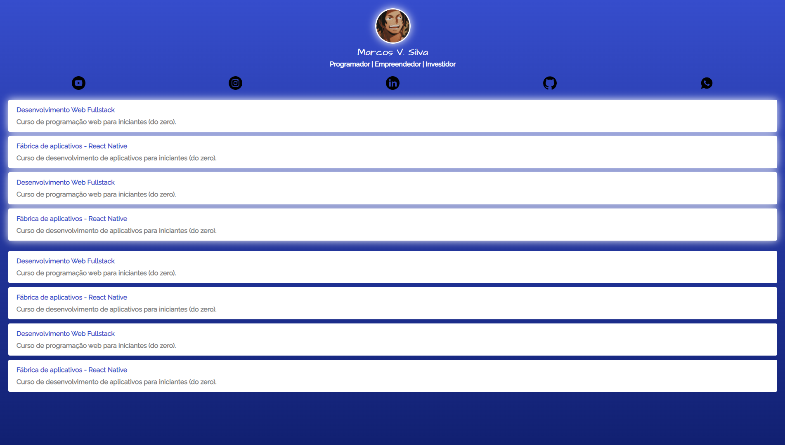

# Projeto LinkTree

## Table of contents

- [Overview](#overview)
  - [The challenge](#the-challenge)
  - [Links](#links)
- [My process](#my-process)
  - [Built with](#built-with)
  - [What I learned](#what-i-learned)
  - [Continued development](#continued-development)
  - [Useful resources](#useful-resources)
- [Author](#author)

## Overview

- Projeto Linktree

### The challenge

Fazer código da página através de uma imagem

- Conseguir replicar a página estática

### Links

- Live Site URL: [https://senhorover.github.io/projects/Form_FS/Projeto-LinkTree/index.html](https://senhorover.github.io/projects/Form_FS/Projeto-LinkTree/index.html)

## My process

### Built with

- Semantic HTML5 markup
- CSS custom properties
- Flexbox

### What I learned

- O Básico de HTML e CSS

### Continued development

- Nada para continuar

### Useful resources

- Nada externo

## Author

- Github - [Marcos Vinicius Silva](https://github.com/SenhorOver)
